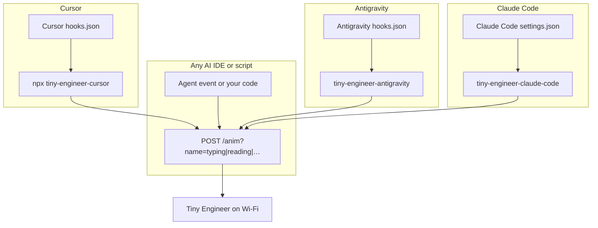

# Integrating Tiny Engineer

Tiny Engineer is a Wi-Fi desk robot. Drive it from any tool that can make HTTP requests, or use one of the dedicated helpers (Cursor, Antigravity, Claude Code) that map agent hook events to poses.

Robot must be on the same network. Base URL: `http://tiny-engineer.local` (or the IP shown on the OLED). Full HTTP reference: [`api.md`](api.md).

Four integration paths:

| Path | Best for | How |
|---|---|---|
| **REST API** | Any AI IDE, script, CI, custom agent | `POST /anim?name=…` |
| **Cursor CLI** | Cursor project hooks | `npx` → `tiny-engineer-cursor` |
| **Antigravity CLI** | Antigravity CLI lifecycle hooks | `tiny-engineer-antigravity` |
| **Claude Code CLI** | Claude Code project hooks | `tiny-engineer-claude-code` |



---

## 1. REST API (any AI IDE)

Call the board directly. Works with Claude Code, Windsurf, Continue, custom plugins, shell hooks, or anything that can `POST` over HTTP.

### Main call

```bash
curl -X POST "http://tiny-engineer.local/anim?name=typing"
```

| `name` | Typical use |
|---|---|
| `typing` | Agent writing / editing / running tools |
| `reading` | Agent reading files / context |
| `thinking` | Agent reasoning / waiting on a long step |
| `ring` | Turn finished (attention ping) |
| `welcome` | Session start / greeting |
| `wakeup` | Sleep-inertia wake (eyes/head) |
| `sleep` | Force sleep (eye close + OLED off) |
| `attention` | Needs user input |
| `error` / `abort` | Failure / cancel |
| `dead` | Out of power (error line, then X X hold) |
| `none` | Idle / clear pose |

Firmware holds each pose ≥1s and keeps only the **latest** pending switch — spam-safe. Auth is optional: if you set an access token on the device, send `Authorization: Bearer <token>` (check `GET /auth` for `required`). Prefer short timeouts (e.g. 2s) and ignore network errors so the agent never stalls if the robot is offline.

### Minimal examples

**Shell**

```bash
curl -4 -sS -m 2 -X POST "http://tiny-engineer.local/anim?name=reading" >/dev/null || true
```

**JavaScript (Node 18+)**

```js
await fetch("http://tiny-engineer.local/anim?name=thinking", {
  method: "POST",
  signal: AbortSignal.timeout(2000),
}).catch(() => {});
```

**Python**

```python
import urllib.request
urllib.request.urlopen(
    urllib.request.Request(
        "http://tiny-engineer.local/anim?name=typing",
        method="POST",
    ),
    timeout=2,
)
```

Wire these into your IDE’s hook / plugin / lifecycle events (prompt submitted → `reading`, tool use → `typing`, turn end → `ring`, etc.). Mapping is yours; the robot only cares about `name`.

Health check (no motion):

```bash
curl http://tiny-engineer.local/health
```

More routes (tests, servo, web UI): [`api.md`](api.md).

---

## 2. Cursor dedicated script

For [Cursor](https://cursor.com/) only: a small Node CLI reads Cursor hook JSON on stdin, picks an animation, and POSTs `/anim`. No need to implement the event map yourself.

### Command

```bash
npx -y --package=https://github.com/jamro/tiny-engineer/archive/refs/heads/main.tar.gz tiny-engineer-cursor
```

- HTTPS **tarball** (not `github:…` SSH shorthand — that often fails in Cursor hooks with no SSH agent).
- Bin name `tiny-engineer-cursor` required after `--package=…`.
- Optional: `--url http://192.168.x.x` (default `http://tiny-engineer.local`).
- Auth: if the device has an `access_token`, set `TINY_ENGINEER_TOKEN` in the process env or a project-root `.env` file (same value). The CLI sends `Authorization: Bearer …`. No token → no header (auth disabled on device).
- `--help` for usage and event map.

### Smoke test

```bash
npx -y --package=https://github.com/jamro/tiny-engineer/archive/refs/heads/main.tar.gz tiny-engineer-cursor --help
echo '{"hook_event_name":"stop"}' | npx -y --package=https://github.com/jamro/tiny-engineer/archive/refs/heads/main.tar.gz tiny-engineer-cursor
```

### Wire into any Cursor project

In that project’s `.cursor/hooks.json`, use the same command for each anim hook. Set **`timeout` ≥ 30** (cold `npx` can exceed 2s). Full sample + event table: [`hooks.md`](hooks.md).

Inside this firmware repo you can instead run the local bin while developing the CLI:

```bash
node packages/tiny-engineer-cursor/bin/tiny-engineer-cursor.js
```

---

## 3. Antigravity CLI dedicated script

For [Google Antigravity](https://github.com/google/antigravity) (`antigravity-cli`): a lightweight Node CLI receives Antigravity lifecycle hook payloads on stdin, maps the agent lifecycle / tool calls to animations, and responds with the expected hook decision JSON while posting `/anim`.

### Event Mapping
- **`PreInvocation`** (Model thinking) → `thinking`
- **`PreToolUse`** (Reading tools: `view_file`, `grep_search`, `find_by_name`, `list_dir`, etc.) → `reading`
- **`PreToolUse`** (Writing tools: `write_to_file`, `replace_file_content`, `run_command`) → `typing`
- **`PostToolUse`** (Tool error) → `attention`
- **`Stop`** (`model_stop` / completion) → `ring` (rings the physical desk bell!)
- **`Stop`** (`error` / `aborted`) → `error` / `abort`

### Setup

Inside this firmware repository, [`.agents/hooks.json`](../.agents/hooks.json) is pre-configured. Run the local bin: `node packages/tiny-engineer-antigravity/bin/tiny-engineer-antigravity.js`. Other machines can `npx -y --package=https://github.com/jamro/tiny-engineer/archive/refs/heads/main.tar.gz tiny-engineer-antigravity` (same tarball pattern as Cursor).

To run globally across all projects on your machine, configure `~/.gemini/config/hooks.json`:

```json
{
  "tiny-engineer": {
    "PreInvocation": [
      {
        "command": "tiny-engineer-antigravity PreInvocation",
        "timeout": 3
      }
    ],
    "PreToolUse": [
      {
        "matcher": "*",
        "hooks": [
          {
            "command": "tiny-engineer-antigravity PreToolUse",
            "timeout": 3
          }
        ]
      }
    ],
    "PostToolUse": [
      {
        "matcher": "*",
        "hooks": [
          {
            "command": "tiny-engineer-antigravity PostToolUse",
            "timeout": 3
          }
        ]
      }
    ],
    "Stop": [
      {
        "command": "tiny-engineer-antigravity Stop",
        "timeout": 3
      }
    ]
  }
}
```

---

## 4. Claude Code dedicated script

For [Claude Code](https://code.claude.com/): a small Node CLI reads Claude Code hook JSON on stdin, picks an animation, and POSTs `/anim`. Same shape as the Cursor CLI — one command for every hook, no animation args.

### Event Mapping
- **`SessionStart`** (`startup`, a fresh launch) → `welcome`
- **`SessionStart`** (`resume`, `clear`, `compact`, `fork`, or no `source`) → `wakeup`
- **`SessionEnd`** → `sleep` (skipped for `clear` and `resume`, where the next `SessionStart` wakes the robot)
- **`UserPromptSubmit`** → `reading`
- **`PreToolUse`** (Reading tools: `Read`, `Grep`, `Glob`, `WebFetch`, `WebSearch`) → `reading`
- **`PreToolUse`** (Writing tools: `Bash`, `PowerShell`, `Edit`, `Write`, `NotebookEdit`) → `typing`
- **`SubagentStart`** → `thinking`
- **`PostToolBatch`** (tool results go back to the model) → `thinking`
- **`PostToolUseFailure`** (a tool call failed) → `error`
- **`PreCompact`** → `thinking`
- **`PermissionRequest`** → `attention`
- **`PermissionDenied`** (auto mode denied a tool call) → `abort`
- **`Notification`** (permission prompt, or waiting for input) → `attention`
- **`Stop`** (turn finished) → `ring` (rings the physical desk bell!)
- **`StopFailure`** → `error`

To change the map, edit [`packages/tiny-engineer-claude-code/src/map.js`](../packages/tiny-engineer-claude-code/src/map.js).

### Setup

Inside this firmware repository, [`.claude/settings.json`](../.claude/settings.json) is pre-configured: open the repo in Claude Code (Node.js 18+) and the hooks run `node packages/tiny-engineer-claude-code/bin/tiny-engineer-claude-code.js`.

- Every hook is `"async": true`, so Claude Code runs it in the background — an offline robot never stalls a tool call on the 2s HTTP timeout.
- Robot address: `TINY_ENGINEER_URL` or `--url http://192.168.x.x` (default `http://tiny-engineer.local`).
- Auth: if the device has an `access_token`, set `TINY_ENGINEER_TOKEN` in the process env or a project-root `.env` file. The CLI sends `Authorization: Bearer …`. No token → no header (auth disabled on device). When the token comes from the process env, a `TINY_ENGINEER_URL` in the project `.env` is ignored, so a project can't redirect your token; set the URL in the env or with `--url`.
- The CLI never writes to stdout in hook mode — Claude Code adds `SessionStart` / `UserPromptSubmit` hook stdout to the model's context.
- If a hook never fires, run `/hooks` inside Claude Code to confirm the project settings loaded.

To use it in every project, copy the `hooks` block into `~/.claude/settings.json` and replace `$CLAUDE_PROJECT_DIR/packages/…` with the absolute path to this repo's bin.

### Smoke test

```bash
node packages/tiny-engineer-claude-code/bin/tiny-engineer-claude-code.js --help
echo '{"hook_event_name":"Stop"}' | node packages/tiny-engineer-claude-code/bin/tiny-engineer-claude-code.js
```

---

## Which to choose?

- **Building for one IDE / custom agent** → REST. One `POST`, zero Node dependency.
- **Using Cursor and want zero mapping code** → Cursor CLI + hooks.
- **Using Antigravity CLI** → Antigravity CLI + hooks.
- **Using Claude Code** → Claude Code CLI + hooks.
- **All four** are fine together: the CLIs are thin clients of the same `/anim` API.

Prerequisites for any path: flash firmware, join 2.4 GHz Wi-Fi, confirm `http://tiny-engineer.local/health` (or the OLED IP) responds.

---

## Optional extras

Same `POST /anim` API; not part of the four paths above. On macOS you can run a small host helper that POSTs `sleep` / `wakeup` when the screen locks or unlocks: [`macos-lock-unlock.md`](macos-lock-unlock.md). The robot does not need it.
